# 🏛️ Elector Lookup Portal

[](https://nextjs.org/)
[](https://www.typescriptlang.org/)
[](https://tailwindcss.com/)
[](https://supabase.com/)
[](https://www.python.org/)
[](https://vercel.com/)
[](docs/security-checklist.md)
[](#-free-tier-architecture--zero-cost-footprint)

> **Enterprise-grade, secure, internal web portal and high-performance ETL pipeline for instant elector (voter) profile lookups by EPIC number.**

---

## 📑 Table of Contents

- [Overview](#-overview)
- [Key Features](#-key-features)
- [System Architecture & Data Flow](#-system-architecture--data-flow)
- [Database & Security Design](#-database--security-design)
- [ETL Data Pipeline](#-etl-data-pipeline)
- [Project Directory Structure](#-project-directory-structure)
- [Quick Start Guide](#-quick-start-guide)
  - [1. Prerequisites](#1-prerequisites)
  - [2. Database Provisioning](#2-database-provisioning)
  - [3. Run the ETL Ingestion Pipeline](#3-run-the-etl-ingestion-pipeline)
  - [4. Launch the Web Application](#4-launch-the-web-application)
- [Environment Variables Reference](#-environment-variables-reference)
- [Production Deployment](#-production-deployment)
- [Free-Tier Architecture & Zero-Cost Footprint](#-free-tier-architecture--zero-cost-footprint)
- [Troubleshooting & Operational Playbook](#-troubleshooting--operational-playbook)
- [Documentation Directory](#-documentation-directory)
- [Project Status & Boundaries](#-project-status--boundaries)
- [License](#-license)

---

## 🌟 Overview

The **Elector Lookup Portal** replaces fragmented, slow-to-search Excel spreadsheets and multi-page PDF electoral rolls with a centralized, sub-second search engine and administrative interface.

Built for internal operations teams, field workers, and verification staff, authorized users can instantly locate voter profiles by entering an **EPIC (Electors Photo Identity Card) number**. The portal renders full voter demographics, relationship structures, residential details, and serial assignments in responsive **Card** and **Print-Optimized Table** layouts.

```
┌─────────────────────────┐     ┌────────────────────────┐     ┌────────────────────────┐
│  Raw Source Files       │ ──▶ │  Automated Python ETL  │ ──▶ │  PostgreSQL Database   │
│  (Excel .xlsx / PDF)    │     │  (Extract, Clean, Dedup)│     │  (Indexed, RLS-Locked) │
└─────────────────────────┘     └────────────────────────┘     └───────────┬────────────┘
                                                                           │
┌─────────────────────────┐     ┌────────────────────────┐                 │
│  Authorized Team Member │ ◀── │  Next.js 14 Web Portal │ ◀────────────────┘
│  (Card / Table / Print) │     │  (SSR, Edge Middleware)│
└─────────────────────────┘     └────────────────────────┘
```

---

## ✨ Key Features

- 🔍 **Instant EPIC Lookup Engine:** Real-time client-side formatting (auto-uppercase, non-alphanumeric strip) coupled with strict regex validation (`^[A-Z]{3}\d{7}$`) before issuing server requests.
- ⚡ **Zero-Waterfall Server Components:** Built with Next.js 14 App Router and React Server Components (RSC) for direct server-side database querying without client-side network round-trips.
- 🎛️ **Dual Interactive Presentation Modes:**
  - **Visual Profile Card:** High-contrast key metrics (Age, Sex, Serial Number) with structured detail grids for administrative clarity.
  - **Data-Dense Table View:** Clean 2-column tabular view complete with dedicated print stylesheet (`@media print`) designed for single-sheet A4 printing.
- 🛡️ **Military-Grade Multi-Layer Security:**
  - **Database Level:** Row Level Security (RLS) policies restrict all queries exclusively to authenticated users; public/anonymous access is hard-denied at the engine level.
  - **Application Level:** Edge Middleware verifies session cookies on every protected route (`/dashboard`, `/profile/*`).
  - **Credential Isolation:** High-privilege `SUPABASE_SERVICE_ROLE_KEY` is strictly confined to offline ETL operations and never bundled into frontend builds.
  - **Zero PII Logging:** Voter demographics and personally identifiable information are never written to logs or console traces.
- 🔄 **Idempotent High-Speed Ingestion:** Python ETL pipeline parses multi-sheet Excel workbooks and tabular PDFs, normalizes 30+ column naming variations, removes duplicates, and performs bulk upserts (`ON CONFLICT (epic_number) DO UPDATE`).
- 💸 **100% Free-Tier Architecture:** Designed from the ground up to operate reliably on free-tier services (Supabase + Vercel Hobby) with zero hosting or database maintenance fees.

---

## 🏛️ System Architecture & Data Flow

```mermaid
graph TD
    subgraph Data_Layer ["Offline Data Foundation (Local / Secure Server)"]
        SRC["Raw Files: Excel (.xlsx) / PDF (.pdf)"]
        EXT["etl/extract.py<br/>Header Auto-Detect & Sheet Parser"]
        CLN["etl/clean.py<br/>Canonical Mapping & Sanitization"]
        VAL["etl/validate.py<br/>Regex Validation & Deduplication"]
        ING["etl/ingest.py<br/>Bulk Upsert (psycopg2 / REST)"]
        
        SRC --> EXT --> CLN --> VAL --> ING
    end

    subgraph Database_Layer ["Cloud Database & Security (Supabase)"]
        AUTH["Supabase Auth<br/>(Named Team Accounts, No Public Signup)"]
        DB[(PostgreSQL 15<br/>electors Table)]
        IDX["B-Tree Index<br/>idx_electors_epic_number"]
        RLS["Row Level Security<br/>TO authenticated USING (true)"]
        
        ING -- "Service Role Key (Bypasses RLS)" --> DB
        DB --- IDX
        DB --- RLS
    end

    subgraph Web_Layer ["Application & Delivery Layer (Vercel)"]
        MW["Edge Middleware<br/>Session Validation & Route Guard"]
        LOGIN["/login<br/>Email/Password Auth"]
        DASH["/dashboard<br/>Normalized EPIC Search Bar"]
        PROF["/profile/[epic]<br/>React Server Component (RSC)"]
        
        MW --> LOGIN
        MW --> DASH
        MW --> PROF
    end

    subgraph Client_Layer ["Client Device (Desktop / Mobile / Tablet)"]
        USER(("Authorized User"))
        CARD["Visual Profile Card"]
        TABLE["Printable Table View (A4)"]
        
        USER <--> Web_Layer
        PROF --> CARD
        PROF --> TABLE
        AUTH <--> MW
        RLS <--> PROF
    end

    classDef db fill:#e8f5e9,stroke:#2e7d32,stroke-width:2px;
    classDef web fill:#e3f2fd,stroke:#1565c0,stroke-width:2px;
    classDef etl fill:#fff3e0,stroke:#e65100,stroke-width:2px;
    class DB,IDX,RLS,AUTH db;
    class MW,LOGIN,DASH,PROF web;
    class SRC,EXT,CLN,VAL,ING etl;
```



---

## 🗄️ Database & Security Design

### Entity-Relationship & Schema Definition

The database utilizes a single, high-performance table indexed on the canonical business key (`epic_number`):

```sql
CREATE TABLE IF NOT EXISTS electors (
    id              BIGSERIAL PRIMARY KEY,
    serial_number   INTEGER,
    epic_number     VARCHAR(11) NOT NULL UNIQUE,
    name            TEXT NOT NULL,
    relative_name   TEXT,
    address         TEXT,
    qualification   VARCHAR(100),
    occupation      VARCHAR(100),
    age             INTEGER,
    sex             CHAR(1) CHECK (sex IN ('M', 'F')),
    photo_url       TEXT,          -- Reserved for future photo integration (NULL in v1)
    created_at      TIMESTAMPTZ DEFAULT NOW(),
    updated_at      TIMESTAMPTZ DEFAULT NOW()
);

-- Unique index for sub-millisecond lookups
CREATE UNIQUE INDEX IF NOT EXISTS idx_electors_epic_number 
    ON electors (epic_number);
```

### Row Level Security (RLS) Policy

```sql
-- 1. Enable RLS
ALTER TABLE electors ENABLE ROW LEVEL SECURITY;

-- 2. Authenticated users can SELECT
CREATE POLICY "Authenticated users can read electors"
    ON electors FOR SELECT
    TO authenticated
    USING (true);

-- 3. Anonymous users are explicitly denied
CREATE POLICY "Anonymous users cannot read electors"
    ON electors FOR SELECT
    TO anon
    USING (false);
```

> 🔒 **Security Boundary Guarantee:** Even if an unauthenticated attacker bypasses frontend routing or issues raw HTTP requests against Supabase PostgREST endpoints, the PostgreSQL engine returns zero rows.

---

## ⚙️ ETL Data Pipeline

The ETL pipeline transforms unstructured, inconsistent municipal electoral registers into validated, structured records.

```
┌─────────────────┐     ┌─────────────────┐     ┌─────────────────┐     ┌─────────────────┐
│ 1. EXTRACT      │ ──▶ │ 2. CLEAN        │ ──▶ │ 3. VALIDATE     │ ──▶ │ 4. INGEST       │
│ Auto-detect     │     │ 30+ column maps │     │ Strict regex    │     │ Fast binary COPY│
│ header row,     │     │ Unicode trim,   │     │ & deduplication │     │ or batch upsert │
│ parse sheets/PDF│     │ Sex/Age format  │     │ audit logging   │     │ with fallback   │
└─────────────────┘     └─────────────────┘     └─────────────────┘     └─────────────────┘
```

### Supported Column Variations

The cleaner handles over 30 Indian electoral data column header variations automatically:

| Canonical Field | Detected Header Variations |
|---|---|
| `epic_number` | `epic`, `epic_no`, `voter_id`, `card_no`, `epic no`, `epicno`, `voter id`, `id card no` |
| `name` | `elector_name`, `voter_name`, `name_en`, `candidate_name`, `full_name`, `elector name` |
| `relative_name` | `father_name`, `husband_name`, `guardian_name`, `rel_name`, `relation_name`, `father/husband name` |
| `address` | `house_no`, `residence`, `address_line`, `polling_area`, `address_en`, `full_address` |
| `serial_number` | `sl_no`, `sr_no`, `sno`, `serial`, `roll_no`, `sequence_no` |
| `age` | `elector_age`, `voter_age`, `age_years` |
| `sex` | `gender`, `m/f`, `sex_code` |

### Pipeline CLI Flags & Syntax

The orchestrator (`etl/main.py`) provides a robust command-line interface:

```bash
# Ingest all Excel & PDF files from data folder
python main.py --source ../data --ingest

# Dry-run validation only (outputs statistics & validation errors)
python main.py --source ../data --dry-run --verbose

# Save cleaned & standardized records to CSV
python main.py --source ../data --output ./output/cleaned_electors.csv

# Ingest from a pre-cleaned CSV directly via fast binary COPY
python main.py --input ./output/cleaned_electors.csv --ingest --method copy
```

| Flag | Argument | Description |
|---|---|---|
| `--source` | `<path>` | Directory containing `.xlsx`, `.xls`, or `.pdf` files. |
| `--input` | `<path>` | Path to an already-cleaned `.csv` file for direct ingestion. |
| `--output` | `<path>` | Destination path to export standardized CSV without ingesting. |
| `--ingest` | *None* | Triggers Supabase database ingestion. |
| `--dry-run` | *None* | Executes extraction, cleaning, and validation without writing to DB. |
| `--method` | `copy` \| `rest` | Ingestion engine: `copy` (high-speed direct PostgreSQL) or `rest` (Supabase HTTP API). Default: `copy`. |
| `--verbose` | *None* | Activates debug-level diagnostic output in terminal and log output. |

---

## 📂 Project Directory Structure

```
elector-lookup-portal/
├── etl/                           # 🐍 Python ETL Data Pipeline
│   ├── extract.py                 # Multi-format extractor (Excel, openpyxl, pdfplumber)
│   ├── clean.py                   # Column normalizer, regex sanitizers, type coercers
│   ├── validate.py                # Business-rule validation, deduplicator, audit reports
│   ├── ingest.py                  # High-speed psycopg2 COPY & Supabase REST batch upsert
│   ├── main.py                    # ETL CLI orchestrator
│   ├── schema.sql                 # PostgreSQL DDL, B-Tree indexes, and RLS policies
│   ├── requirements.txt           # Python dependencies
│   ├── .env.example               # Template for database credentials
│   └── output/                    # Generated audit reports and cleaned CSVs
│
├── web/                           # ⚡ Next.js 14 App Router Web Application
│   ├── app/
│   │   ├── layout.tsx             # Root layout, fonts, meta tags, and global providers
│   │   ├── page.tsx               # Root entry redirecting to /dashboard or /login
│   │   ├── globals.css            # Tailwind directives + @media print styles
│   │   ├── login/
│   │   │   └── page.tsx           # Authentication screen with feedback states
│   │   ├── dashboard/
│   │   │   ├── layout.tsx         # App shell header, branding, user session, logout
│   │   │   └── page.tsx           # Centered search interface with instant normalizer
│   │   └── profile/
│   │       └── [epic]/
│   │           └── page.tsx       # React Server Component for direct DB lookup
│   ├── components/
│   │   ├── SearchBar.tsx          # Real-time normalization, regex validation, keyboard nav
│   │   ├── ProfileCard.tsx        # High-impact visual profile with badges & detail grid
│   │   ├── ProfileTable.tsx       # 2-column tabular layout with direct A4 print trigger
│   │   ├── ViewToggle.tsx         # Seamless switcher between Card and Table modes
│   │   ├── PhotoPlaceholder.tsx   # Initials-based avatar generator (photo fallback)
│   │   ├── EmptyState.tsx         # User-friendly missing elector state with search link
│   │   └── LogoutButton.tsx       # Secure session termination handler
│   ├── lib/
│   │   ├── supabase/
│   │   │   ├── client.ts          # Browser client (createBrowserClient)
│   │   │   ├── server.ts          # Server client with secure cookie store integration
│   │   │   └── middleware.ts      # Edge middleware session handler
│   │   ├── types.ts               # TypeScript interfaces (Elector, ElectorDisplayData)
│   │   └── utils.ts               # EPIC sanitizers, initials generators, Tailwind utilities
│   ├── middleware.ts              # Edge route guard protecting internal paths
│   ├── package.json               # Node.js dependencies and run scripts
│   ├── tailwind.config.ts         # Design tokens, typography, and theme styling
│   └── .env.example               # Template for client-safe public keys
│
├── data/                          # 📁 Source Data Files (gitignored for privacy)
│   ├── excel/                     # Client .xlsx / .xls workbooks
│   └── pdf/                       # Client electoral roll PDFs
│
├── docs/                          # 📚 Comprehensive System Documentation
│   ├── architecture.md            # In-depth architectural design and component specs
│   ├── database-schema.md         # Schema DDL, query plans, index analysis, RLS matrix
│   ├── etl-guide.md               # Step-by-step pipeline operation and edge-case handling
│   ├── deployment-guide.md        # Vercel & Supabase production release guide
│   ├── testing-strategy.md        # Quality assurance matrices and test test suites
│   ├── security-checklist.md      # Pre-deployment compliance and security audit
│   ├── context.md                 # Project background, domain concepts, specifications
│   ├── glossary.md                # Domain terminology and acronyms
│   └── open-questions.md          # Project decisions and roadmap tracking
│
├── AGENTS.md                      # AI agent guardrails and architectural directives
├── progress.md                    # Detailed multi-phase build tracker
├── .gitignore                     # Repository privacy and credential exclusions
└── README.md                      # Master project documentation (this file)
```

---

## 🚀 Quick Start Guide

### 1. Prerequisites

Ensure you have the following installed in your environment:
- **Node.js**: `v20.x` or higher (`node -v`)
- **Python**: `v3.12.x` (`python --version`)
- **Package Managers**: `npm` (or `pnpm` / `yarn`) and `pip`
- **Database**: A free [Supabase](https://supabase.com) project

---

### 2. Database Provisioning

1. Log in to your [Supabase Dashboard](https://supabase.com/dashboard) and open your project.
2. Navigate to the **SQL Editor**.
3. Copy and execute the contents of [`etl/schema.sql`](etl/schema.sql):
   ```sql
   -- Creates the electors table, indexes, and activates Row Level Security
   ```
4. Navigate to **Authentication → Providers → Email**:
   - Turn **OFF** *"Allow new users to sign up"* (strictly prevents public registration).
5. Navigate to **Authentication → Users** and create accounts for authorized team members:
   - Click **"Add user"** → Enter Email & Password → Check **"Auto Confirm User"**.

---

### 3. Run the ETL Ingestion Pipeline

```bash
# 1. Navigate to the ETL directory
cd etl

# 2. Create and activate a Python virtual environment
python -m venv venv
# On Windows:
venv\Scripts\activate
# On macOS/Linux:
# source venv/bin/activate

# 3. Install required Python packages
pip install -r requirements.txt

# 4. Configure environment credentials
cp .env.example .env
# Edit .env and supply your Supabase URL, Service Role Key, and Database Connection URL

# 5. Place your source files in data/excel/ or data/pdf/

# 6. Execute dry-run validation (verifies headers, cleaning, and deduplication)
python main.py --source ../data --dry-run --verbose

# 7. Ingest all records into Supabase
python main.py --source ../data --ingest
```

---

### 4. Launch the Web Application

```bash
# 1. Navigate to the web application directory
cd ../web

# 2. Install Node dependencies
npm install

# 3. Configure local environment variables
cp .env.example .env.local
# Edit .env.local and set NEXT_PUBLIC_SUPABASE_URL and NEXT_PUBLIC_SUPABASE_ANON_KEY

# 4. Start local development server
npm run dev
```

Open your browser and navigate to **`http://localhost:3000`**. You will be redirected to the secure login screen. Log in using the credentials created in Step 2.

---

## 🔐 Environment Variables Reference

The project separates client-safe public keys from high-privilege administrative secrets.

### Web Application (`web/.env.local`)
*Required for local development and deployed to Vercel.*

| Variable Name | Required | Description | Scope / Exposure |
|---|---|---|---|
| `NEXT_PUBLIC_SUPABASE_URL` | **Yes** | Your Supabase project URL (`https://xyz.supabase.co`). | Public (Browser & Server) |
| `NEXT_PUBLIC_SUPABASE_ANON_KEY` | **Yes** | Supabase anonymous public API key (subject to RLS). | Public (Browser & Server) |

### ETL Pipeline (`etl/.env`)
*Required strictly on local machine or secure ETL runner. **NEVER** expose to the web client.*

| Variable Name | Required | Description | Scope / Exposure |
|---|---|---|---|
| `SUPABASE_URL` | **Yes** | Your Supabase project URL. | Private (ETL only) |
| `SUPABASE_SERVICE_ROLE_KEY` | **Yes** | Administrative service role key (bypasses RLS). | Private (ETL only) |
| `DATABASE_URL` | **Yes** | Direct PostgreSQL connection string for fast binary COPY. | Private (ETL only) |

---

## 🌐 Production Deployment

### Automated Vercel Release

Deploy the frontend application to Vercel in seconds:

```bash
cd web
npx vercel
```

1. Select your team scope and accept project settings.
2. Open the **Vercel Dashboard** → Navigate to **Project Settings → Environment Variables**.
3. Add the following production variables:
   - `NEXT_PUBLIC_SUPABASE_URL` = `https://<your-project>.supabase.co`
   - `NEXT_PUBLIC_SUPABASE_ANON_KEY` = `<your-anon-key>`
4. Trigger production build:
   ```bash
   npx vercel --prod
   ```

### Post-Deployment Verification Checklist

- [x] Unauthenticated request to `/dashboard` redirects to `/login`.
- [x] Login with authorized credentials forwards to `/dashboard`.
- [x] Invalid EPIC search (e.g. `ABC12345`) triggers inline regex warning before sending network traffic.
- [x] Valid EPIC search (e.g. `TYA0633792`) loads elector profile in under 1 second.
- [x] Toggle between **Card View** and **Table View** functions seamlessly.
- [x] Table View print trigger (`window.print()`) isolates data table cleanly on A4 paper.
- [x] Logout invalidates session cookies and redirects to `/login`.

---

## 💰 Free-Tier Architecture & Zero-Cost Footprint

This system is engineered specifically to operate under ₹0 / $0 infrastructure costs without sacrificing speed or security:

| Service | Free Tier Allowance | Project Consumption | Headroom / Strategy |
|---|---|---|---|
| **Supabase PostgreSQL** | 500 MB Database Storage | ~100 MB (200,000 voter records) | **5x Headroom** remaining on single table schema. |
| **Supabase Auth** | 50,000 Monthly Active Users | < 50 Internal Team Users | **1,000x Headroom**. |
| **Vercel Hosting** | 100 GB Bandwidth / Month | ~2–5 GB / Month | Static assets + cached RSC payloads minimize bandwidth. |
| **Database Auto-Pause Mitigation** | Supabase pauses after 7 days idle | Automated keepalive ping | Configure a free 5-day HTTP cron ping via [cron-job.org](https://cron-job.org) on `/login`. |

---

## 🛠️ Troubleshooting & Operational Playbook

<details>
<summary><b>1. "Database connection refused" or ETL fails to connect</b></summary>

- **Cause:** Direct PostgreSQL port `5432` or pooler port `6543` might be blocked by your network/firewall, or password special characters are unencoded.
- **Fix:** In `etl/.env`, verify `DATABASE_URL` uses URL-encoded credentials (`urllib.parse.quote_plus`). Alternatively, run ETL using the REST API fallback:
  ```bash
  python main.py --source ../data --ingest --method rest
  ```
</details>

<details>
<summary><b>2. Search returns "Something went wrong" or takes > 5 seconds</b></summary>

- **Cause:** Supabase free-tier database went to sleep after 7 days of inactivity (cold start).
- **Fix:** Wait 10 seconds for the database instance to awaken, then refresh. Prevent future sleeping by setting up an external ping cron job.
</details>

<details>
<summary><b>3. Login screen hangs or redirects in a loop</b></summary>

- **Cause:** Clock skew between server and client or corrupted local cookies.
- **Fix:** Clear browser cookies for the domain or verify that `NEXT_PUBLIC_SUPABASE_URL` matches the dashboard URL exactly.
</details>

<details>
<summary><b>4. Elector photo displays placeholder avatar</b></summary>

- **Status:** **Expected Behavior.** Photo extraction and storage are in `PENDING` status as per product specifications. All electors intentionally render initials placeholders in v1.
</details>

---

## 📖 Documentation Directory

For in-depth technical specifications, review our complete documentation library:

- 🏛️ [**Architecture & System Design**](docs/architecture.md) — Comprehensive technical architecture, component breakdown, and design decisions.
- 🗄️ [**Database Schema & Query Guide**](docs/database-schema.md) — Full DDL, index mechanics, RLS security matrix, and query execution plans.
- 🐍 [**ETL Pipeline Guide**](docs/etl-guide.md) — Exhaustive operational manual for extracting, cleaning, and ingesting massive voter rolls.
- 🚀 [**Deployment Guide**](docs/deployment-guide.md) — Production release procedures, domain mapping, and SSL configuration.
- 🧪 [**Testing Strategy**](docs/testing-strategy.md) — End-to-end testing matrix covering unit, integration, responsive, and print tests.
- 🛡️ [**Security Checklist**](docs/security-checklist.md) — Pre-flight audit covering data isolation, session handling, and PII protection.
- 📋 [**Project Context & Requirements**](docs/context.md) — Background context, client requirements, and operational constraints.
- 📚 [**Domain Glossary**](docs/glossary.md) — Comprehensive reference of domain terms (EPIC, Part Number, RLS, etc.).
- ❓ [**Decisions & Open Questions Log**](docs/open-questions.md) — Architecture decisions and future milestone roadmaps.

---

## 🚧 Project Status & Boundaries

### Active Scope (v1.0)
- ✅ Exact-match EPIC search (`^[A-Z]{3}\d{7}$`).
- ✅ Authenticated named logins via Supabase Auth.
- ✅ Dual layout presentation (Profile Card & Printable Table).
- ✅ Automated multi-sheet Excel & PDF ETL pipeline.
- ✅ Full RLS protection and zero-PII security boundary.

### Explicitly Excluded from v1.0
- ⛔ **Voter Photos:** Pending client confirmation (`photo_url` remains `NULL`).
- ⛔ **Fuzzy / Name Search:** Search is strictly scoped to unique EPIC numbers to eliminate false positive identifications.
- ⛔ **Public Registration:** Self-signup is disabled; access is invite-only.
- ⛔ **Bulk Export / Admin Panel:** Prevent unauthorized data exfiltration.

---

## 📄 License

**Confidential & Proprietary.** Private internal tool developed for authorized client operations. Unauthorized distribution, copying, or public deployment is strictly prohibited.
